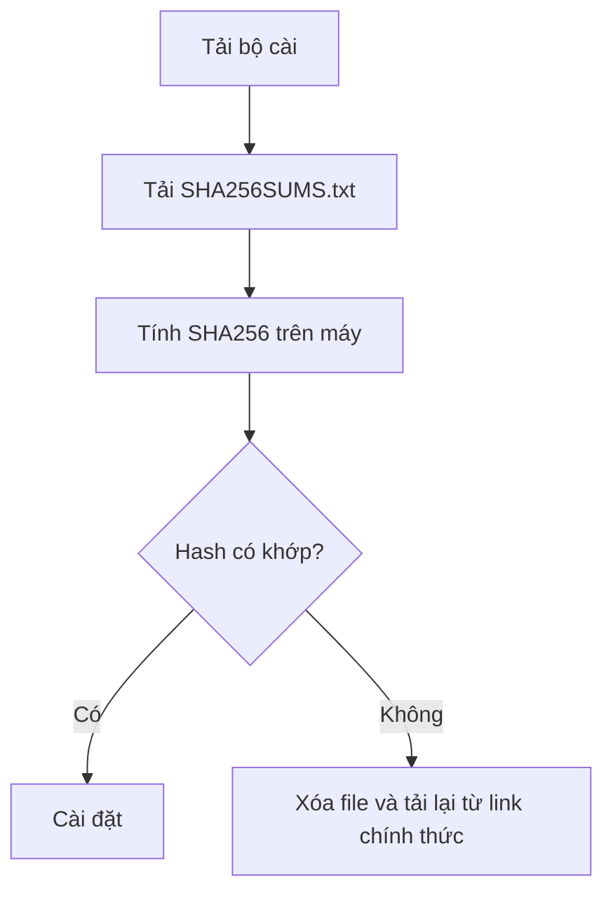

# AI for Boss

**Trợ lý AI chạy trên máy tính cá nhân cho chủ doanh nghiệp nhỏ, người kinh doanh một mình và người đi làm ở Việt Nam.**

AI for Boss giúp anh chị giao việc thật cho AI: đọc tài liệu, soạn nội dung, xử lý tệp, làm báo cáo, hỗ trợ bán hàng, chăm sóc khách, theo dõi công việc và tự động hóa các việc lặp lại. Ứng dụng chạy trên máy của anh chị, kết nối với công cụ và dữ liệu anh chị cho phép, rồi làm việc theo từng nhiệm vụ cụ thể.

> Kho này là kênh giới thiệu và tải app. Mã nguồn sản phẩm được giữ ở kho riêng tư.

## Tải xuống

👉 **Tải bản mới nhất:** https://github.com/LucDinhLe/aiforboss/releases/latest

| Hệ điều hành | File nên tải | Ghi chú |
| --- | --- | --- |
| Windows 10/11 | `AIforBoss-2026.9.29-win-x64.exe` | Phù hợp đa số máy Windows 64-bit. |
| macOS Apple Silicon | `AIforBoss-2026.9.29-mac-arm64.dmg` | Dành cho Mac chip M1/M2/M3/M4. |
| Linux Debian/Ubuntu | `AIforBoss-2026.9.29-linux-amd64.deb` | Cài qua trình quản lý gói `.deb`. |
| Linux khác | `AIforBoss-2026.9.29-linux-x86_64.AppImage` | Chạy dạng AppImage. |

Bản hiện tại: **AI for Boss 26.9.29**

## AI for Boss giúp gì?

| Việc cần làm | AI for Boss hỗ trợ như thế nào | Kết quả anh chị nhận được |
| --- | --- | --- |
| Soạn nội dung bán hàng, email, tin nhắn | Viết nháp, chỉnh giọng, tạo nhiều phương án | Nội dung dùng được ngay, bớt ngồi nghĩ từ đầu |
| Chăm sóc khách hàng | Soạn phản hồi, phân loại yêu cầu, gợi ý bước tiếp theo | Trả lời nhất quán, giảm bỏ sót khách |
| Làm báo cáo | Đọc bảng/tệp, gom ý chính, trình bày thành báo cáo | Báo cáo rõ việc, số liệu, rủi ro và hành động tiếp theo |
| Quản lý việc lặp lại | Ghi lại quy trình, tạo kỹ năng, nhắc việc định kỳ | Việc thủ công được đóng gói để làm lại nhanh hơn |
| Làm việc với tài liệu | Đọc, tóm tắt, trích việc cần làm, kiểm tra nội dung | Tài liệu dài thành danh sách hành động dễ xử lý |
| Vận hành cá nhân/doanh nghiệp nhỏ | Lên kế hoạch, theo dõi tiến độ, rà quyết định | Có người phụ việc số để đỡ quên và đỡ rối |

## Luồng làm việc


## Điểm mạnh

| Điểm mạnh | Ý nghĩa thực tế |
| --- | --- |
| Chạy trên máy cá nhân | AI có thể làm việc với tệp, trình duyệt và công cụ trên máy khi anh chị cho phép. |
| Có kỹ năng tiếng Việt cho kinh doanh nhỏ | Không chỉ chat chung chung; có các quy trình cho bán hàng, marketing, báo cáo, công nợ, hợp đồng, tuyển dụng, chăm sóc khách. |
| Làm việc nhiều bước | Có thể đọc, phân tích, sửa file, chạy lệnh, kiểm tra lại kết quả thay vì chỉ trả lời một đoạn văn. |
| Có nguyên tắc an toàn | Việc gửi ra ngoài, tốn tiền, xóa dữ liệu hoặc khó hoàn tác phải hỏi anh chị trước. |
| Có ghi nhớ và sổ quyết định | Những lựa chọn đã chốt được ghi lại để không hỏi đi hỏi lại. |
| Có thể mở rộng | Có thể thêm kỹ năng, kết nối công cụ và tự động hóa theo cách làm riêng của doanh nghiệp. |

## Phù hợp với ai?

- Chủ doanh nghiệp nhỏ cần một trợ lý số làm được việc thực tế.
- Người kinh doanh một mình muốn bớt kẹt ở nội dung, báo cáo, chăm sóc khách và việc lặp lại.
- Người đi làm cần trợ lý xử lý tài liệu, lập kế hoạch, viết nháp, tổng hợp thông tin.
- Người muốn AI chạy trên máy cá nhân thay vì chỉ dùng một ô chat trên web.

## Không phải là gì?

AI for Boss không phải nhân sự thay thế hoàn toàn. Những việc liên quan đến tiền, pháp lý, hợp đồng, dữ liệu nhạy cảm, gửi tin cho khách hoặc đăng nội dung công khai vẫn cần anh chị kiểm tra và chốt trước khi thực hiện.

## Lưu ý khi cài đặt

### Windows

| Tình huống | Cách xử lý |
| --- | --- |
| Windows hiện cảnh báo SmartScreen | Vì bộ cài hiện chưa ký số. Chọn **More info** → **Run anyway** nếu anh chị tin nguồn tải từ repo chính thức này. |
| Trình duyệt cảnh báo file `.exe` ít người tải | Đây là cảnh báo thường gặp với app mới. Chỉ tải từ link release chính thức. |
| Cài đè bản cũ | Có thể cài đè để cập nhật. Nếu đang mở app, hãy thoát app trước khi cài. |

### macOS

| Tình huống | Cách xử lý |
| --- | --- |
| macOS báo không xác minh nhà phát triển | Bộ cài hiện chưa notarize/ký qua Apple Developer. Mở bằng chuột phải → **Open** nếu anh chị tin nguồn tải. |
| Máy Intel | Bản hiện tại ưu tiên Apple Silicon. Nếu anh chị dùng Mac Intel, cần báo để kiểm tra bản phù hợp. |

### Linux

| Gói | Cách dùng |
| --- | --- |
| `.deb` | Dành cho Debian/Ubuntu và bản phân phối tương thích. |
| `.AppImage` | Cấp quyền chạy rồi mở trực tiếp. |

## Kiểm tra file tải

Release có kèm `SHA256SUMS.txt`. Anh chị có thể dùng file này để kiểm tra bộ cài tải về không bị thay đổi.



## Bản quyền và giấy phép

AI for Boss là sản phẩm thương mại của Lê Đình Lực.

- Mã nền Hermes giữ giấy phép MIT và ghi công gốc.
- Phần AI for Boss do Lê Đình Lực viết, đóng gói và định vị theo giấy phép riêng / PolyForm Perimeter 1.0.0.
- Kho public này chỉ dùng để giới thiệu và phát hành file tải, không chứa mã nguồn đầy đủ của sản phẩm.

Xem thêm: [GIAY-PHEP.md](GIAY-PHEP.md)

## Nguồn bản build

Các file tải trong release public được build từ kho nguồn riêng tư `LucDinhLe/ai-for-boss`.

Bản `v2026.9.29` hiện tại được build từ commit private source:

```text
bc136e1feb9f1f5c0a2c4a8e91e90caee85becdd
```

Build run nội bộ: `36656857632`

## Liên hệ

Website: https://aiforboss.net
