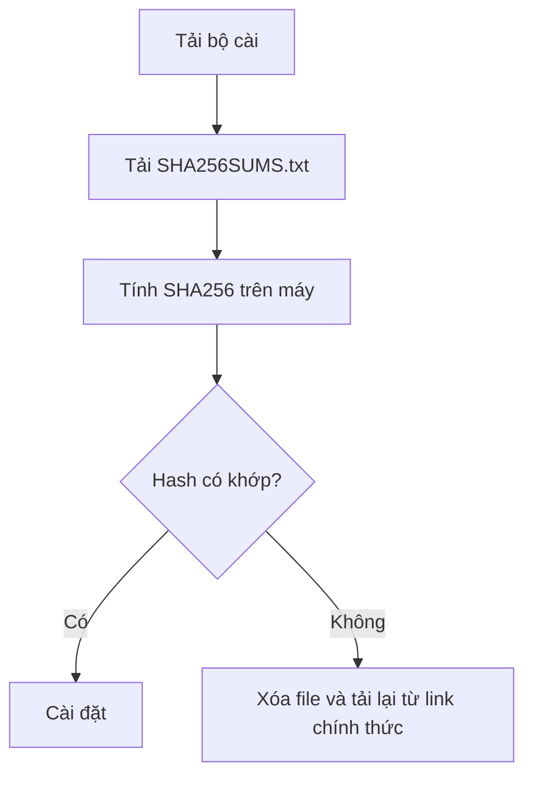

  

  <h1>AI for Boss</h1>

  
<strong>Trợ lý AI chạy trên máy tính cá nhân cho chủ doanh nghiệp nhỏ, người kinh doanh một mình và người đi làm ở Việt Nam.</strong>

  

    Giao việc thật cho AI: đọc tài liệu, soạn nội dung, xử lý tệp, làm báo cáo, hỗ trợ bán hàng, chăm sóc khách và tự động hóa việc lặp lại.
  

  

    <a href="#ai-for-boss-là-gì">AI for Boss là gì?</a> •
    <a href="#điểm-mạnh">Điểm mạnh</a> •
    <a href="#tiện-ích-mang-lại">Tiện ích</a> •
    <a href="#tải-xuống-trực-tiếp">Tải xuống</a> •
    <a href="#lưu-ý-khi-cài-đặt">Lưu ý cài đặt</a> •
    <a href="#giấy-phép">Giấy phép</a>
  

  

    
    
  

  

    <a href="https://github.com/LucDinhLe/aiforboss/releases/download/v2026.9.29/AIforBoss-2026.9.29-win-x64.exe"><strong>⬇️ Tải Windows</strong></a>
    &nbsp;•&nbsp;
    <a href="https://github.com/LucDinhLe/aiforboss/releases/download/v2026.9.29/AIforBoss-2026.9.29-mac-arm64.dmg"><strong>⬇️ Tải macOS</strong></a>
    &nbsp;•&nbsp;
    <a href="https://github.com/LucDinhLe/aiforboss/releases/download/v2026.9.29/AIforBoss-2026.9.29-linux-amd64.deb"><strong>⬇️ Tải Linux .deb</strong></a>
    &nbsp;•&nbsp;
    <a href="https://github.com/LucDinhLe/aiforboss/releases/download/v2026.9.29/AIforBoss-2026.9.29-linux-x86_64.AppImage"><strong>⬇️ Tải AppImage</strong></a>
  

---

## Tải xuống trực tiếp

Bản hiện tại: **AI for Boss 26.9.29**  
Trang release: https://github.com/LucDinhLe/aiforboss/releases/latest

| Hệ điều hành | Bộ cài trực tiếp | Dung lượng | Ghi chú |
| --- | --- | ---: | --- |
| Windows 10/11 | [Tải `.exe`](https://github.com/LucDinhLe/aiforboss/releases/download/v2026.9.29/AIforBoss-2026.9.29-win-x64.exe) | 346 MB | Khuyến nghị cho đa số máy Windows 64-bit. |
| macOS Apple Silicon | [Tải `.dmg`](https://github.com/LucDinhLe/aiforboss/releases/download/v2026.9.29/AIforBoss-2026.9.29-mac-arm64.dmg) | 387 MB | Dành cho Mac M1 trở lên  |
| Linux Debian/Ubuntu | [Tải `.deb`](https://github.com/LucDinhLe/aiforboss/releases/download/v2026.9.29/AIforBoss-2026.9.29-linux-amd64.deb) | 321 MB | Cài bằng gói `.deb`. |
| Linux khác | [Tải `.AppImage`](https://github.com/LucDinhLe/aiforboss/releases/download/v2026.9.29/AIforBoss-2026.9.29-linux-x86_64.AppImage) | 400 MB | Chạy trực tiếp dạng AppImage. |
| Kiểm tra file | [SHA256SUMS.txt](https://github.com/LucDinhLe/aiforboss/releases/download/v2026.9.29/SHA256SUMS.txt) | nhỏ | Dùng để kiểm hash file tải. |

> Nếu chỉ dùng Windows, anh chị tải file `.exe` là đủ.

## AI for Boss là gì?

AI for Boss là ứng dụng desktop giúp anh chị giao việc cho AI như một trợ lý số. Thay vì chỉ hỏi đáp trong một ô chat, AI for Boss có thể làm việc theo nhiều bước: hiểu mục tiêu, chọn kỹ năng phù hợp, đọc tệp hoặc trang web được phép, tạo bản nháp, sửa file, kiểm tra kết quả và báo lại phần đã làm.

Ứng dụng hướng tới bối cảnh Việt Nam: chủ doanh nghiệp nhỏ, người kinh doanh một mình, đội nhóm ít người và người đi làm cần tiết kiệm thời gian ở các việc viết, đọc, tổng hợp, báo cáo và vận hành.

## Tiện ích mang lại

| Nhu cầu | AI for Boss giúp gì | Kết quả thực tế |
| --- | --- | --- |
| Soạn nội dung | Viết bài, email, tin nhắn, mô tả sản phẩm, kịch bản chăm sóc khách | Có bản nháp tốt để sửa nhanh thay vì viết từ đầu |
| Chăm sóc khách hàng | Soạn phản hồi, xử lý từ chối, phân loại yêu cầu, gợi ý bước tiếp theo | Trả lời đều giọng, bớt bỏ sót khách |
| Bán hàng và marketing | Lập brief chiến dịch, phân tích đối thủ, thiết kế ưu đãi, viết báo giá | Có khung làm việc rõ để triển khai nhanh hơn |
| Báo cáo và điều hành | Gom số liệu, viết báo cáo tuần/tháng, rà rủi ro, nêu việc cần quyết | Dễ nắm tình hình và biết việc tiếp theo |
| Tài liệu và tệp | Đọc tài liệu dài, rút ý chính, trích đầu việc, tạo file mới | Tài liệu dài thành danh sách hành động |
| Quy trình lặp lại | Đóng gói cách làm thành kỹ năng, dùng lại cho lần sau | Giảm việc thủ công và giảm phụ thuộc trí nhớ |

## Điểm mạnh

| Điểm mạnh | Ý nghĩa với người dùng |
| --- | --- |
| Chạy trên máy cá nhân | Làm việc với tệp, trình duyệt và công cụ cục bộ khi anh chị cho phép. |
| Có kỹ năng tiếng Việt | Có sẵn quy trình cho bán hàng, marketing, chăm sóc khách, công nợ, hợp đồng, tuyển dụng, báo cáo. |
| Làm việc nhiều bước | Không chỉ trả lời văn bản; có thể dùng công cụ, sửa tệp, kiểm tra lại kết quả. |
| Có nguyên tắc an toàn | Việc gửi ra ngoài, tốn tiền, xóa dữ liệu hoặc khó hoàn tác phải hỏi trước. |
| Ghi nhớ quyết định | Những lựa chọn đã chốt được ghi lại để không hỏi đi hỏi lại. |
| Mở rộng được | Có thể thêm kỹ năng và kết nối công cụ theo cách làm riêng của doanh nghiệp. |

## Sơ đồ cách hoạt động

## Phù hợp với ai?

- Chủ doanh nghiệp nhỏ cần một trợ lý số làm được việc thực tế.
- Người kinh doanh một mình muốn bớt kẹt ở nội dung, báo cáo, chăm sóc khách và việc lặp lại.
- Người đi làm cần trợ lý xử lý tài liệu, lập kế hoạch, viết nháp, tổng hợp thông tin.
- Người muốn AI chạy trên máy cá nhân thay vì chỉ dùng một trang chat trên web.

## Không phải là gì?

AI for Boss không phải nhân sự thay thế hoàn toàn và không tự quyết các việc quan trọng thay anh chị. Những việc liên quan đến tiền, pháp lý, hợp đồng, dữ liệu nhạy cảm, gửi tin cho khách hoặc đăng nội dung công khai vẫn cần anh chị kiểm tra và chốt trước khi thực hiện.

## Lưu ý khi cài đặt

### Windows

| Tình huống | Cách xử lý |
| --- | --- |
| Windows hiện cảnh báo SmartScreen | Vì bộ cài hiện chưa ký số. Chọn **More info** → **Run anyway** nếu anh chị tin nguồn tải từ repo chính thức này. |
| Trình duyệt cảnh báo file `.exe` ít người tải | Đây là cảnh báo thường gặp với app mới. Chỉ tải từ link release chính thức. |
| Cài đè bản cũ | Có thể cài đè để cập nhật. Nếu đang mở app, hãy thoát app trước khi cài. |

### macOS

| Tình huống | Cách xử lý |
| --- | --- |
| macOS báo không xác minh nhà phát triển | Bộ cài hiện chưa notarize/ký qua Apple Developer. Mở bằng chuột phải → **Open** nếu anh chị tin nguồn tải. |
| Máy Intel | Bản hiện tại ưu tiên Apple Silicon. Nếu anh chị dùng Mac Intel, cần báo để kiểm tra bản phù hợp. |

### Linux

| Gói | Cách dùng |
| --- | --- |
| `.deb` | Dành cho Debian/Ubuntu và bản phân phối tương thích. |
| `.AppImage` | Cấp quyền chạy rồi mở trực tiếp. |

## Kiểm tra file tải

Release có kèm `SHA256SUMS.txt`. Anh chị có thể dùng file này để kiểm tra bộ cài tải về không bị thay đổi.

## Thông tin bản phát hành

| Mục | Giá trị |
| --- | --- |
| Phiên bản | AI for Boss 26.9.29 |
| Tag | `v2026.9.29` |
| Kho tải công khai | `LucDinhLe/aiforboss` |
| Kho nguồn | `LucDinhLe/ai-for-boss` private |
| Commit nguồn | `bc136e1feb9f1f5c0a2c4a8e91e90caee85becdd` |
| Build run | `36656857632` |

## Giấy phép

AI for Boss là sản phẩm thương mại của Lê Đình Lực.

- Mã nền Hermes giữ giấy phép MIT và ghi công gốc.
- Phần AI for Boss do Lê Đình Lực viết, đóng gói và định vị theo giấy phép riêng / PolyForm Perimeter 1.0.0.
- Kho public này chỉ dùng để giới thiệu và phát hành file tải, không chứa mã nguồn đầy đủ của sản phẩm.

Xem thêm: [GIAY-PHEP.md](GIAY-PHEP.md)

## Liên hệ

Website: https://aiforboss.net
